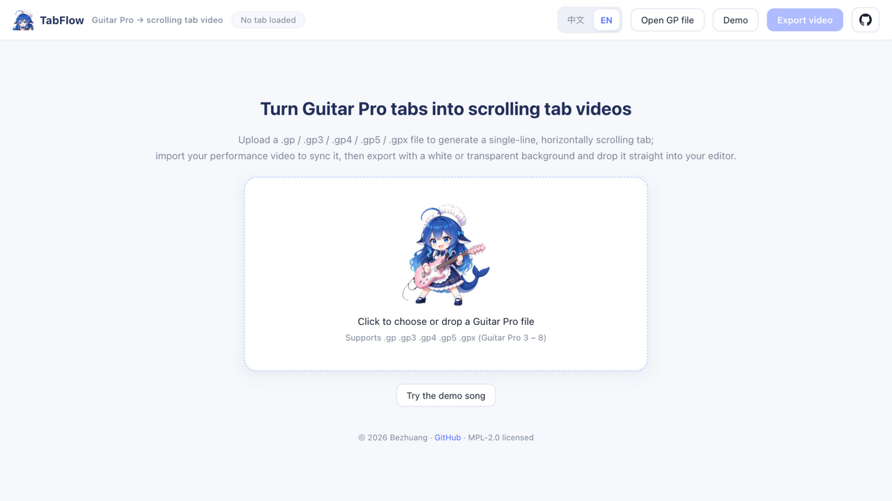

# TabFlow · Turn guitar tabs into a scrolling video

**English** · [中文](README-CN.md)

**In one sentence**: upload a Guitar Pro tab and it becomes a scrolling tab video that follows the music — ready to overlay on your own performance footage and share on YouTube, Bilibili, TikTok or Instagram.



The app has a full English UI. Switch with the **中文 / EN** toggle in the top bar; your choice is remembered, and first-time visitors get the language their browser asks for.

- **Live app**: <https://tabflow.bezhuang.cn/>
- **Repository**: <https://github.com/Bezhuang/tabflow>

No editing skills and no software install needed — everything happens in the browser in a few clicks.

## When you'd want this

- You recorded a **cover / performance video** and want viewers to see "what's being played, where the tab is"
- You teach **guitar / piano / drums** and want students to follow every phrase (numbered notation, standard notation or tablature)
- You don't want to sync captions frame by frame in a video editor — you just want a **file you can use**

## How it works

1. **Load the tab** — drop in a Guitar Pro file (`.gp3 / .gp4 / .gp5 / .gpx / .gp`, i.e. Guitar Pro 3–8). Guitar, bass, piano and drums all render correctly.
2. **Turn it into a scrolling tab** — the tab becomes a single long line scrolling right to left: the bar being played is highlighted in light blue, and the playhead walks to your chosen position and then holds while the tab scrolls itself. At repeat signs, alternate endings or D.C./D.S./Coda/Fine marks the playhead jumps back to the right section, following the real performance order.
3. **Sync it with your playing** — drop in your performance video and the tab follows the video timeline; if it runs early or late, nudge it with the ±10 ms buttons, and toggle the video audio on or off while previewing.
4. **Export a video** — size, background and colors are all adjustable live (see the next sections).

## Notation and tracks

- Click a track under **Tracks** to switch which one is shown (one at a time). When overlaying on your video, you usually want just the lead track you're playing.
- **Three notation modes**: **numbered / standard / tablature**. Numbered and standard modes keep the tablature line alongside for reference; tablature mode shows only the tab.
- Special tracks adapt automatically: **piano** uses a grand staff (treble + bass, standard notation); **drums** use standard drum notation — notes mapped outside the staff range are hidden instead of drawing a runaway ledger line.

## Background and colors

- **Light / dark**: a solid background filling the frame, ready to publish as-is. Lower *background opacity* and it becomes a semi-transparent band exactly as tall as the tab, which you can overlay as a backing plate on your footage.
- **Transparent background** (for overlaying in an editor; export with Chrome or Edge):
  - **Tab color** — any color via the picker, or the white / black / blue / yellow shortcuts;
  - **Background color** — any color via the picker, or *No background* for a fully transparent tab layer;
  - **Background opacity 0–100%** — at 100% the background fills the frame; below 100% only a semi-transparent band the height of the tab remains, letting your footage show through (lower = more transparent).
- **Tab opacity** is adjustable on its own, controlling how strong the tab itself looks.
- On export, transparent / semi-transparent backgrounds automatically use **WebM with an alpha channel** (VP8), ready to drop into CapCut / Premiere / Final Cut / DaVinci.

## Frame size and zoom

- Output size: 1080p landscape 16:9 / 720p / portrait 9:16 (Shorts / Reels) / square 1:1 / custom width and height;
- Tab zoom, playhead lock position and vertical position (centered / above center / below center) are all live and WYSIWYG;
- Export at 30 or 60 fps, the full song or a custom time range, optionally burning in the performance video with its original audio — one step to a finished video.

## Three steps

1. **Open the page** → click **Demo** to see it working (a built-in four-track demo: guitar / bass / piano / drums), or drag in your own Guitar Pro file
2. **Import your performance video** (optional) → play and fine-tune until the tab lines up with your playing
3. **Click Export video** → pick size and background → wait for the progress bar and the video downloads automatically

> Tip: use Chrome or Edge to export a **transparent** background.
> Everything runs in your own browser — your tabs and videos are **never uploaded to any server**.

## FAQ

**Q: I don't own Guitar Pro. Can I still use this?**
Yes. Only the `.gp` file itself is needed, and plenty of tab sites offer those.

**Q: How many tracks can be shown at once?**
One at a time — click a track under **Tracks** to switch.

**Q: The tab's size, position or color isn't right?**
Everything is adjustable live in the side panel: output size, tab zoom, playhead lock position, vertical position, background color and opacity, tab opacity, notation… all WYSIWYG.

**Q: Are sections, tempo marks and picking directions shown?**
Yes. The tab is rendered in Guitar Pro's own style: section titles, ♩=tempo, time signatures, picking directions (Π/V), hammer-on and pull-off slurs, and so on.

**Q: Can the transparent-background video be used directly?**
Yes. It exports WebM with an alpha channel — place it as an overlay layer above your performance video in CapCut / Premiere / Final Cut / DaVinci, no keying required.

## For developers

A pure front-end app (React + TypeScript + Vite); the build output is static files and can be deployed to any static host.

- Score parsing and engraving: [alphaTab](https://github.com/CoderLine/alphaTab) (MPL-2.0), with the Bravura music font
- Video export: Canvas compositing + MediaRecorder real-time capture (opaque / transparent WebM, optional MP4, can mix in the video's original audio)

```bash
npm install
npm run dev      # local development
npm run build    # build to dist/
npm run preview  # preview the build
```

**Internationalization**: UI copy lives in `src/i18n/messages.ts` (Chinese / English), with the non-React translator in `src/i18n/translate.ts` and the provider in `src/i18n/provider.tsx`. The mobile layout is a set of `@media` rules at the end of `src/styles.css`.

**Deployment**: the repo ships a GitHub Actions workflow that builds and publishes on every push to `main` (the live site uses the custom domain `tabflow.bezhuang.cn`, kept by `public/CNAME`); you can also import it into Vercel directly (framework Vite, build command `npm run build`, output directory `dist`).

**Repeats and jumps**: repeat signs, alternate endings (volta brackets) and D.C./D.S./Coda/Fine are all followed when playing back — the tab stays laid out linearly in Guitar Pro's own style, the playhead jumps back at each repeat, and the total duration (and the exported video length) includes the repeated sections.

**Known limitations**: export is a real-time recording, so it takes as long as the selection — keep the page in the foreground; drum notes mapped outside the staff range aren't shown.

## License

Released under [MPL-2.0](LICENSE), matching the alphaTab dependency.

Score parsing and rendering come from [alphaTab](https://github.com/CoderLine/alphaTab) — thanks to Daniel Kuschny and all contributors.

---

[中文说明 →](README-CN.md)
